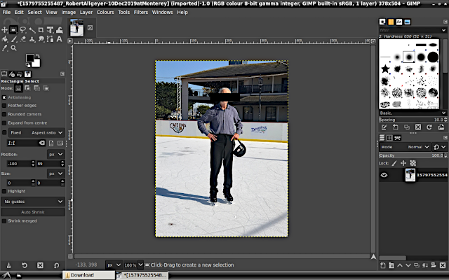

# alaterm
LXDE Desktop for Arch Linux ARM on Termux Android

This repository was initialized on February 22, 2020. Within the next few days, I will upload code. Do not attempt to run any of the scripts, until I tell you that it is OK. Currently, I need to verify that the scripts "when downloaded from here" work the same as they do "from my own device."

Summary: I have a 10.1in Samsung Galaxy Tab A 2019 WiFi tablet, no phone, not rooted. Using the Termux and VNC Viewer apps, I have been able to install Arch Linux ARM with an excellent LXDE desktop. Then, I can run GIMP, LibreOffice, and a variety of other programs that work with touchscreen or mouse and keyboard. Should work with a variety of devices that run 32-bit or 64-bit Android, but there is little benefit for small-screen devices.

Installation is very complex. For that purpose, I have written a lengthy BASH script that does it all, complete with configuration. When done, it "just works" with a selection of basic utility programs, and is ready for immediate installation of bigger programs. Of course, this kind of device has limitations.

The script is written for the benefit of those who have little or no knowledge of programming. It is not a fork of the well-known TermuxArch project.

INSTALLATION (Android only):
(February 27, 2020: Do not install yet. I am still testing this site.)

1. At the Google Play Store, install these two free, ad-free apps:

  Termux, by Fredric Fornwall

  VNC Viewer, by RealVNC

2. Open Termux. Update it, and install wget. Commands:

  pkg update

  pkg install wget

3. Allow Termux permission to access files in the shared areas of your device. This will allow Termux, and alaterm, to do things such as transfer files into the system for editing, then ship them back out to where other apps can find them. If you deny this permission, then Termux (and alaterm) have no way to communicate with shared files in your device. Command:
termux-setup-storage

4. Download the alaterm setup script into Termux. The following command is all one line, even if it wraps here:

  wget https://raw.githubusercontent.com/cargocultprog/alaterm/master/00-alaterm.bash

5, Run the script. This downloads the remainder of the alaterm scripts, then launches installation. First it adds some necessary programs to Termux. Then it will download a large archive from the Arch Linux ARM project, about 450MB. Then it will unpack the archive, taking a long time to do that. Unnecessary features will be removed. A new user is created. Then the software needed for the LXDE graphical desktop is downloaded, installed, and configured. All together, this may take an hour to complete, more or less, depending on your Internet speed. Are you ready? Command:
bash 00-alaterm.bash install

6. When it is all done, a launch command is installed where Termux can find it. To launch alaterm, command:

  alaterm

7. After launch, alaterm is active within Termux. In some cases, you will use the command line to do things. Right now, have a look at the graphical desktop. Leave alaterm running in Termux. Open the VNC Viewer app. Android will send Termux to the background, but be sure that you do not close Termux. After a short slide show, VNC Viewer will allow you to create a new connection. You can give it any name you like. Its address is:

  127.0.0.1:5901

8. When you connect, you will be asked for a password. The password is: password
Be sure to save the password, so that you do not need to re-enter it each time.

9. If all went well, and it probably did, then you will see the LXDE Desktop. At the bottom is a taskbar. In the left corener of the taskbar is the applications Menu, with a few utility programs pre-installed. Next to the Menu is the file manager. The Menu includes a help file among its choices.

10. You are now ready to install some fancy applications, if your device can handle them. Installation is done from the terminal, not from the graphical desktop. Here are a few suggestions:

  pkg install gimp

  pkg install inkscape

  pkg install libreoffice-still

11. When you wish to leave alaterm, you do it from the terminal. Command:

  logout

That brings you back to Termux. Then you can exit Termux. If you leaave the VNC Viewer running, then the next time you look at it, it will say that it lost the connection. This is normal behavior. If you re-launch alaterm, then VNC Viewer must be re-connected manually.

12. If you fail to logout of alaterm properly, such as by shutting off your device whiloe alaerm is running, then the next time you attempt to launch alaterm you will get a message saying that a problem was detected and (hopefully) fixed. Then you can issue the launch command a second time.

13. Remember that alaterm does not create applications. It merely installs and configures applications provided from somewhere else. So, there is not point to asking for new software or new features. You can ask for bug fixes in the scripts, but this is the wrong place to ask for bug fixes in the installed software.

